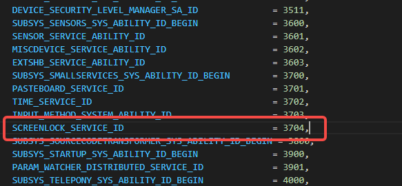

# miscservices_screenlock

#### 介绍

向三方应用提供解锁屏幕，判断屏幕是否锁屏，判断当前设备的屏幕锁定是否安全的能力。响应窗口和电源的开机，亮灭屏事件，支持多用户场景,锁屏管理服务运行状态回调

**图 1** 子系统架构图  


#### 仓路径

/base/miscservices/screenlock

#### 框架代码介绍

```
/base/miscservices/screenlock
├── figures                  # 构架图
├── frameworks/kitsimpl      # 对应用提供的接口
├── interfaces/kits          # 组件对外提供的接口代码
│   ├── jskits               # 服务间接口
│   └── napi                 # js接口解析成napi接口
├── sa_profile               # 组件包含的系统服务的配置文件和进程的配置文件
├── services                 # 锁屏管理服务实现
├── test                     # 接口的单元测试
└── utils                    # 组件包含日志打印和有序公共事件定义的常量
```

#### js 接口及使用说明

1.  js 接口

```
function isScreenLocked(callback: AsyncCallback<boolean>): void; 判断屏幕是否锁屏，callback方式
function isScreenLocked(): Promise<boolean>; 判断屏幕是否锁屏，Promise方式

function isSecureMode(callback: AsyncCallback<boolean>): void; 判断当前设备的屏幕锁定是否安全(安全屏幕锁定意味着解锁屏幕需要密码、图案或其他用户身份识别)，callback方式
function isSecureMode(): Promise<boolean>; 判断当前设备的屏幕锁定是否安全(安全屏幕锁定意味着解锁屏幕需要密码、图案或其他用户身份识别)，Promise方式

function unlockScreen(callback: AsyncCallback<void>): void; 解锁屏幕，callback方式
function unlockScreen(): Promise<void>; 解锁屏幕，Promise方式

function on(type: 'beginWakeUp' | 'endWakeUp' | 'beginScreenOn' | 'endScreenOn' | 'beginScreenOff' | 'endScreenOff' | 'unlockScreen' | 'beginExitAnimation' | 'systemReady', callback: Callback<void>): void;
function on(type: 'beginSleep' | 'endSleep' | 'changeUser', callback: Callback<number>): void;
function on(type: 'screenlockEnabled', callback: Callback<boolean>): void;

function off(type: 'beginWakeUp' | 'endWakeUp' | 'beginScreenOn' | 'endScreenOn' | 'beginScreenOff' | 'endScreenOff' | 'unlockScreen' | 'beginExitAnimation' | 'systemReady', callback: Callback<void>): void;
function off(type: 'beginSleep' | 'endSleep' | 'changeUser', callback: Callback<number>): void;
function off(type: 'screenlockEnabled', callback: Callback<boolean>): void;

function sendScreenLockEvent(event: String, parameter: number, callback: AsyncCallback<boolean>): void;
function sendScreenLockEvent(event: String, parameter: number): Promise<boolean>;
```

2.  js 接口使用说明

```
// 导入模块
import screenLock from '@ohos.screenlock';

// Promise方式的异步方法查询屏幕锁屏状态
screenLock.isScreenLocked()
    .then((value) => {
        console.log(`success to screenLock.isScreenLocked: ${value}`);
    }).catch((err) => {
        console.error(`failed to screenLock.isScreenLocked because ${err.message}`)
});


// callback方式的异步方法设置时间
screenLock.isScreenLocked((err, value) => {
    if (err) {
        console.error(`failed to screenLock.isScreenLocked because ${err.message}`);
        return;
        }
    console.log(`success to screenLock.isScreenLocked: ${value}`);
});

//注册系统事件

//'beginWakeUp' | 'endWakeUp' | 'beginScreenOn' | 'endScreenOn' | 'beginScreenOff' | 'endScreenOff' | 
//'unlockScreen' | 'beginExitAnimation' | 'beginSleep' | 'endSleep' | 'changeUser' | 'screenlockEnabled'
var eventType = "beginWakeUp";
screenLock.on(eventType, (err, value) => {
    if (err) {
        // 接口调用失败，err非空
        console.error(`screenlockOn_unlockScreen_callback failed, because ${err.message}`);
        return;
    }
    // 接口调用成功，err为空
    console.log(`screenlockOn_unlockScreen_callback success to ${value} `);
});

//请求解锁
screenLock.unlockScreen((err, data) => {
    console.log("Screenlock_Test_2300: send unlockScreen issue success");
    if (err) {
    console.log("Screenlock_Test_2300: unlockScreen fail-->"+err);
    return;
    }
    console.log("Screenlock_Test_2300: unlockScreen success-->"+data);
});

screenLock.unlockScreen().then((data) => {
    console.log("ScreenLock_Test_Promise_0500: unlockScreen success-->"+data);
}).catch((error) => {
    console.error("ScreenLock_Test_Promise_0500: unlockScreen fail--> " + error);
});
```

#### 本框架编译调试方法

1.  配置编译参数
```
1. 仓库代码下载下来，修改工程名为screenlock，放在源码  \base\miscservices 目录下
```
```
2. OpenHarmony/productdefine/common/products/Hi3516DV300.json中在文件末尾添加  "miscservices:screenlock":{}
```


```
3. 在foundation/distributedschedule/samgr/interfaces/innerkits/samgr_proxy/include 的system_ability_definition.h中添加自己服务的id:3704。 
信息：SCREENLOCK_SERVICE_ID = 3704,
```



```

2.  编译命令

```
./build.sh --product-name (填写具体的产品名，如：Hi3516DV300) --build-target screenlock_native
```

3.  推送 so 文件

```
将工程目录下out\ohos-arm-release\miscservices\screenlock下的libscreenlock_server.z.so libscreenlock_client.z.so
libscreenlock_utils.z.so libscreenlock.z.so四个so推送到system/lib/module下，并确保四个so至少为可读状态。
```

4.  重启设备

#### 参与贡献

1.  Fork 本仓库
2.  提交代码
3.  新建 Pull Request
4.  commit 完成即可
